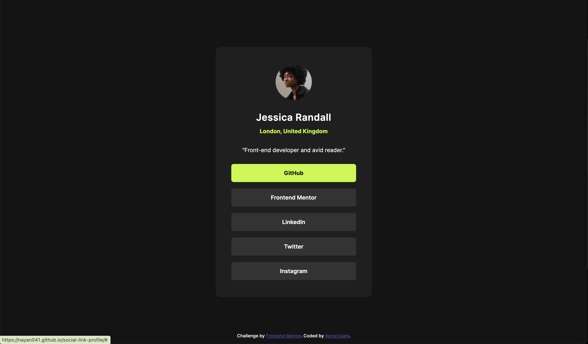
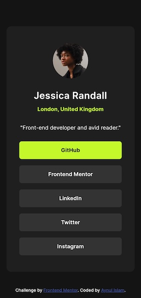

# Frontend Mentor - Social links profile solution

This is a solution to the [Social links profile challenge on Frontend Mentor](https://www.frontendmentor.io/challenges/social-links-profile-UG32l9m6dQ). Frontend Mentor challenges help me improve my coding skills by building very good realistic projects. 

## Table of contents

- [Overview](#overview)
  - [The challenge](#the-challenge)
  - [Screenshot](#screenshot)
  - [Links](#links)
- [My process](#my-process)
  - [Built with](#built-with)
  - [What I learned](#what-i-learned)
  - [Continued development](#continued-development)
  - [Useful resources](#useful-resources)
- [Author](#author)
- [Acknowledgments](#acknowledgments)

## Overview

### The challenge

Users should be able to:

- See hover and focus states for all interactive elements on the page

### Screenshot

### Links

- Solution URL: [GitHub link](https://github.com/nayan041/social-link-profile.git)
- Live Site URL: [Social Link Profiles](https://nayan041.github.io/social-link-profile/)

## My process

### Built with

- Semantic HTML5 markup
- CSS custom properties
- Flexbox

### What I learned

How to maintain size of cards using margin and width properties a little bit.

### Continued development

I want learn CSS card size maintaining processes.

### Useful resources

- [Jonas’ Course on Udemy regarding  HTML and CSS](https://www.udemy.com/course/design-and-develop-a-killer-website-with-html5-and-css3/?couponCode=ST22MT92324A) - This website helped me for growing confidence on Card building.

## Author
- Frontend Mentor - [@nayan041](https://www.frontendmentor.io/profile/nayan041)

## Acknowledgments
- Frontend Mentor.
